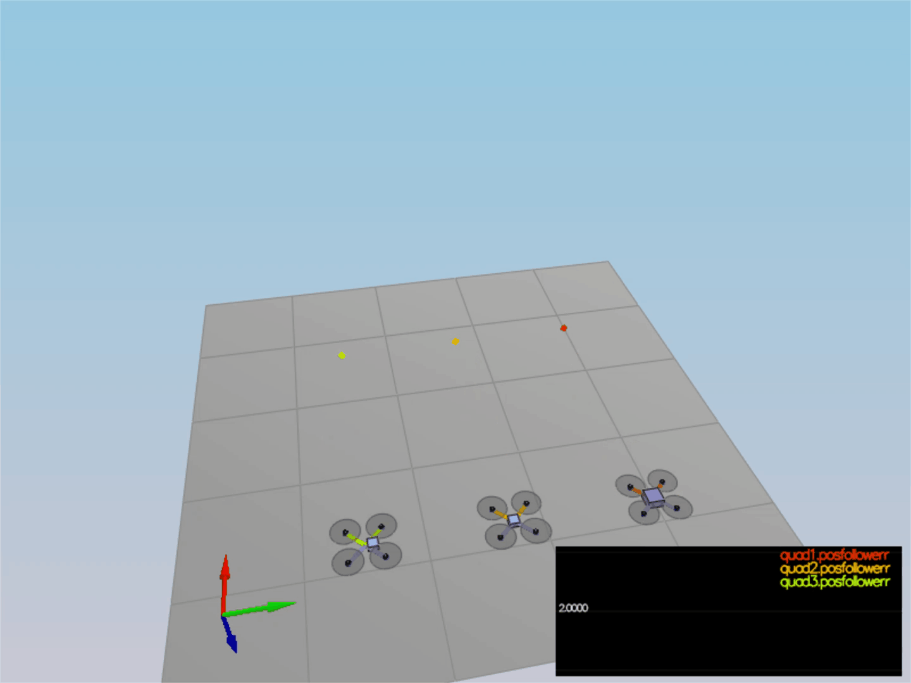

# Project Solution Readme #

### Scenario 1: Hover in same spot ###

- Tuned `Mass` to 0.5 in `QuadControlParams.txt` to get the vehicle to hover in same place

Pass:

### Scenario 2: Body rate and roll/pitch control ###

## 1. Implemented body rate control

 - implemented the code in the function `GenerateMotorCommands()`
 
        float len = L / (2.f * sqrtf(2.f));   
        float p_bar = momentCmd.x / len; // x axis    
        float q_bar = momentCmd.y / len; // y axis 
        float r_bar = -momentCmd.z / kappa; // z axis  
        float c_bar = collThrustCmd;  

       `  // 3D DRONE-FULL-NOTEBOOK (Lesson 4) - Set Propeller Angular Velocities`
       cmd.desiredThrustsN[0] = (c_bar + p_bar + q_bar + r_bar) / 4.f;  // Front Left 
       cmd.desiredThrustsN[1] = (c_bar - p_bar + q_bar - r_bar) / 4.f; // Front Right  
       cmd.desiredThrustsN[2] = (c_bar + p_bar - r_bar - q_bar) / 4.f; //Rear left 
       cmd.desiredThrustsN[3] = (c_bar - p_bar - q_bar + r_bar) / 4.f; //Rear Right  

 - implemented the code in the function `BodyRateControl()`

       V3F I;  
       I.x = Ixx;     
       I.y = Iyy;  
       I.z = Izz;  

       momentCmd = I * kpPQR * (pqrCmd - pqr); 

 - Tuned `kpPQR` in `QuadControlParams.txt` to get the vehicle to stop spinning quickly but not overshoot
 
       kpPQR =43,43, 15

##2. Implemented roll / pitch control

 - implemented the code in the function `RollPitchControl()`
 
       if (collThrustCmd > 0) {
            float acc = -collThrustCmd / mass;
            float b_x_a = R(0, 2);
            float b_x_c = accelCmd.x / acc;
            float b_x_e = b_x_c - b_x_a;
            float b_x_p_term = kpBank * b_x_e; 
            float b_y_a = R(1, 2);
            float b_y_c = accelCmd.y / acc;
            float b_y_e = b_y_c - b_y_a;
            float b_y_p_term = kpBank * b_y_e; 

            pqrCmd.x = (R(1, 0) * b_x_p_term - R(0, 0) * b_y_p_term) / R(2, 2); 
            pqrCmd.y = (R(1, 1) * b_x_p_term - R(0, 1) * b_y_p_term) / R(2, 2); 
           } 
           else { 
              pqrCmd.x = 0.0; 
              pqrCmd.y = 0.0; 
           } `
          pqrCmd.z = 0.0;  

 - Tuned `kpBank` in `QuadControlParams.txt` to minimize settling time but avoid too much overshoot
 
       kpBank = 8 

Pass:

### Scenario 3: Position/velocity and yaw angle control ###

## 1. Implemented the code in the function `LateralPositionControl()`

    if (velCmd.mag() > maxSpeedXY) {
          velCmd = (velCmd.norm() * maxSpeedXY);
      }

      else { 
          velCmd = velCmd; 
      }

      accelCmd = (kpPosXY * (posCmd - pos) + kpVelXY * (velCmd - vel) + accelCmd);

      if (accelCmd.mag() > maxAccelXY) {
          accelCmd = (accelCmd.norm() * maxAccelXY);

      }
      
## 2.  Implemented the code in the function `AltitudeControl()`
      float z_err = posZCmd - posZ;
      float z_err_dot = velZCmd - velZ;

      float p_term = kpPosZ * z_err;
      float d_term = kpVelZ * z_err_dot + velZ;

      //integrator
      integratedAltitudeError += z_err * dt;

      float u_1_bar = p_term + d_term + (integratedAltitudeError * KiPosZ) + accelZCmd;

      float y = R(2, 2);
      float c = (u_1_bar - CONST_GRAVITY) /y;

      thrust = -mass * CONSTRAIN(c, -maxAscentRate / dt, maxAscentRate / dt);
      
## 4.  Tuned parameters `kpPosZ` and `kiPosZ` in `QuadControlParams.txt`
       kpPosZ = 25
       KiPosZ = 40

## 5.  Tuned parameters `kpVelXY` and `kpVelZ`in `QuadControlParams.txt`
       kpVelXY = 12.0
       kpVelZ = 10.0

## 6.  Implemented the code in the function `YawControl()`
       yawRateCmd = fmodf(yawCmd, 2 * F_PI);

       float yaw_Error = yawRateCmd - yaw;

       if (yaw_Error > F_PI) {
           yaw_Error -= 2.0 * F_PI;
       }
       if (yaw_Error < -F_PI) {
           yaw_Error += 2.0 * F_PI;

       }

       yawRateCmd = yaw_Error * kpYaw;

## 7.  Tuned parameters `kpYaw` and the 3rd (z) component of `kpPQR` in `QuadControlParams.txt`
       kpYaw = 2
       kpPQR =43,43, 15

Pass:

### Non-idealities and robustness (scenario 4) ###

In this part, we will explore some of the non-idealities and robustness of a controller.  For this simulation, we will use `Scenario 4`.  This is a configuration with 3 quads that are all are trying to move one meter forward.  However, this time, these quads are all a bit different:
 - The green quad has its center of mass shifted back
 - The orange vehicle is an ideal quad
 - The red vehicle is heavier than usual

1. Run your controller & parameter set from Step 3.  Do all the quads seem to be moving OK?  If not, try to tweak the controller parameters to work for all 3 (tip: relax the controller).

2. Edit `AltitudeControl()` to add basic integral control to help with the different-mass vehicle.

3. Tune the integral control, and other control parameters until all the quads successfully move properly.  Your drones' motion should look like this:

### Tracking trajectories ###

Now that we have all the working parts of a controller, you will put it all together and test it's performance once again on a trajectory.  For this simulation, you will use `Scenario 5`.  This scenario has two quadcopters:
 - the orange one is following `traj/FigureEight.txt`
 - the other one is following `traj/FigureEightFF.txt` - for now this is the same trajectory.  For those interested in seeing how you might be able to improve the performance of your drone by adjusting how the trajectory is defined, check out **Extra Challenge 1** below!

How well is your drone able to follow the trajectory?  It is able to hold to the path fairly well?

### Performance Metrics ###

The specific performance metrics are as follows:

 - scenario 2
   - roll should less than 0.025 radian of nominal for 0.75 seconds (3/4 of the duration of the loop)
   - roll rate should less than 2.5 radian/sec for 0.75 seconds

 - scenario 3
   - X position of both drones should be within 0.1 meters of the target for at least 1.25 seconds
   - Quad2 yaw should be within 0.1 of the target for at least 1 second

 - scenario 4
   - position error for all 3 quads should be less than 0.1 meters for at least 1.5 seconds

 - scenario 5
   - position error of the quad should be less than 0.25 meters for at least 3 seconds

