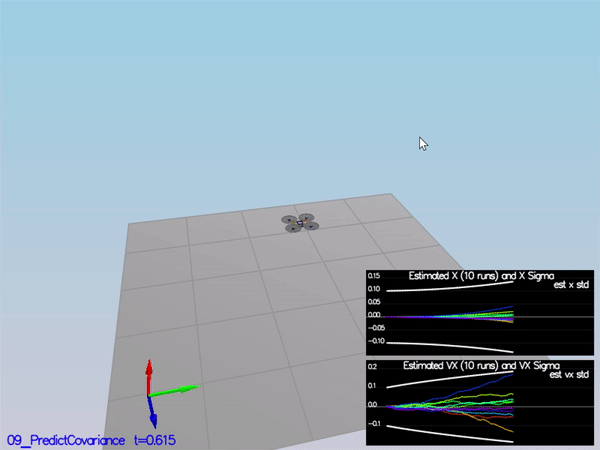

# Estimation Project #

Project outline:

 - [Step 1: Sensor Noise](#step-1-sensor-noise)
 - [Step 2: Attitude Estimation](#step-2-attitude-estimation)
 - [Step 3: Prediction Step](#step-3-prediction-step)
 - [Step 4: Magnetometer Update](#step-4-magnetometer-update)
 - [Step 5: Closed Loop + GPS Update](#step-5-closed-loop--gps-update)
 - [Step 6: Adding Your Controller](#step-6-adding-your-controller)


### Step 1: Sensor Noise ###

For the controls project, the simulator was working with a perfect set of sensors, meaning none of the sensors had any noise.  The first step to adding additional realism to the problem, and developing an estimator, is adding noise to the quad's sensors.  For the first step, I collected some simulated noisy sensor data and estimated the standard deviation of the quad's sensor.

1. I choose scenario `06_NoisySensors` within the simulator.  In this simulation, the interest is to record some sensor data on a static quad, so you will not see the quad move.  You will see two plots at the bottom, one for GPS X position and one for The accelerometer's x measurement.  The dashed lines are a visualization of a single standard deviation from 0 for each signal. The standard deviations are initially set to arbitrary values (after processing the data in the next step, I adjusted these values).  If they were set correctly, we should see ~68% of the measurement points fall into the +/- 1 sigma bound.  When I ran this scenario, the graphs you see will be recorded to the following csv files with headers: `config/log/Graph1.txt` (GPS X data) and `config/log/Graph2.txt` (Accelerometer X data).

2. I processed the logged files to figure out the standard deviation of the the GPS X signal and the IMU Accelerometer X signal.

3. I plugged in the result into the top of `config/6_Sensornoise.txt`under Student Section.  

       MeasuredStdDev_GPSPosXY = .7234
       MeasuredStdDev_AccelXY = .5321


4. I reran the simulator. If the values are correct, the dashed lines in the simulation will eventually turn green, indicating you’re capturing approx 68% of the respective measurements (which is what we expect within +/- 1 sigma bound for a Gaussian noise model)


***Success criteria:*** *Your standard deviations should accurately capture the value of approximately 68% of the respective measurements.*


### Step 2: Attitude Estimation ###

Now let's look at the first step to our state estimation: including information from our IMU.  In this step, I will be improving the complementary filter-type attitude filter with a better rate gyro attitude integration scheme.

1. I ran the scenario `07_AttitudeEstimation`.  For this simulation, the only sensor used is the IMU and noise levels are set to 0 (see `config/07_AttitudeEstimation.txt` for all the settings for this simulation).  There are two plots visible in this simulation.
   - The top graph is showing errors in each of the estimated Euler angles.
   - The bottom shows the true Euler angles and the estimates.
Observe that there’s quite a bit of error in attitude estimation.

2. In `QuadEstimatorEKF.cpp`, you will see the function `UpdateFromIMU()` contains a complementary filter-type attitude filter.  To reduce the errors in the estimated attitude (Euler Angles), I implemented a better rate gyro attitude integration scheme - see below: 

       Quaternion<float> quat = Quaternion<float>::FromEuler123_RPY(rollEst, pitchEst, ekfState(6));

       quat.IntegrateBodyRate(gyro, dtIMU);

       float predictedPitch = quat.Pitch();
       float predictedRoll = quat.Roll();
       ekfState(6) = quat.Yaw();

       // normalize yaw to -pi .. pi

       if (ekfState(6) > F_PI) ekfState(6) -= 2.f * F_PI;
       if (ekfState(6) < -F_PI) ekfState(6) += 2.f * F_PI;
             
       


***Success criteria:*** *Your attitude estimator needs to get within 0.1 rad for each of the Euler angles for at least 3 seconds.*


### Step 3: Prediction Step ###

In this next step I will be implementing the prediction step of the filter.


1. I ran the scenario `08_PredictState`.  This scenario is configured to use a perfect IMU (only an IMU). Due to the sensitivity of double-integration to attitude errors, we've made the accelerometer update very insignificant (`QuadEstimatorEKF.attitudeTau = 100`).  The plots on this simulation show element of your estimated state and that of the true state.  At the moment you should see that your estimated state does not follow the true state.

2. In `QuadEstimatorEKF.cpp`, I implemented the state prediction step in the `PredictState()` functon. If done correctly, when you run scenario `08_PredictState` you should see the estimator state track the actual state, with only reasonably slow drift.

       predictedState(0) = curState(0) + dt * curState(3);
       predictedState(1) = curState(1) + dt * curState(4);
       predictedState(2) = curState(2) + dt * curState(5);


       V3F accelI = attitude.Rotate_BtoI(accel);

       predictedState(3) = curState(3) + dt * accelI.x;

       predictedState(4) = curState(4) + dt * accelI.y;

       predictedState(5) = curState(5) + dt * accelI.z - dt * CONST_GRAVITY;


3. Now let's introduce a realistic IMU, one with noise. I ran the scenario `09_PredictionCov`. You will see a small fleet of quadcopter all using the prediction code to integrate forward. 

You will see two plots:
   - The top graph shows 10 (prediction-only) position X estimates
   - The bottom graph shows 10 (prediction-only) velocity estimates
You will notice however that the estimated covariance (white bounds) currently do not capture the growing errors.

4. In `QuadEstimatorEKF.cpp`, I calculated the partial derivative of the body-to-global rotation matrix in the function `GetRbgPrime()`.
  
       RbgPrime(0, 0) = -cos(pitch) * sin(yaw);
       RbgPrime(0, 1) = -sin(roll) * sin(pitch)*sin(yaw) - cos(pitch) *cos(yaw);
       RbgPrime(0, 2) = -cos(roll) * sin(pitch)*sin(yaw) + sin(roll) *cos(yaw);

       RbgPrime(1, 0) = cos(pitch) * cos(yaw);
       RbgPrime(1, 1) = sin(roll) * sin(pitch)*cos(yaw) - cos(roll) *sin(yaw);
       RbgPrime(1, 2) = cos(roll) * sin(pitch)*cos(yaw) + sin(roll) *sin(yaw);

I also implemented the rest of the prediction step (predict the state covariance forward) in `Predict()`.

       gPrime(0, 3) = dt;
       gPrime(1, 4) = dt;
       gPrime(2, 5) = dt;

       gPrime(3, 6) = (RbgPrime(0) * accel).sum() *dt;
       gPrime(4, 6) = (RbgPrime(1) * accel).sum() *dt;
       gPrime(5, 6) = (RbgPrime(2) * accel).sum() *dt;

       ekfCov = gPrime *ekfCov * gPrime.transpose() + Q;

5.  I also tuned the `QPosXYStd` and the `QVelXYStd` process parameters in `QuadEstimatorEKF.txt`

        QPosXYStd = .05
        QVelZStd = .1



***Success criteria:*** *This step doesn't have any specific measurable criteria being checked.*


### Step 4: Magnetometer Update ###

Up until now I've only used the accelerometer and gyro for our state estimation.  In this step, I will be adding the information from the magnetometer to improve the filter's performance in estimating the vehicle's heading.

1. I ran the scenario `10_MagUpdate`.  This scenario uses a realistic IMU, but the magnetometer update hasn’t been implemented yet. As a result, you will notice that the estimate yaw is drifting away from the real value (and the estimated standard deviation is also increasing).  Note that in this case the plot is showing you the estimated yaw error (`quad.est.e.yaw`), which is drifting away from zero as the simulation runs.  You should also see the estimated standard deviation of that state (white boundary) is also increasing.

2. I tuned the parameter `QYawStd` (`QuadEstimatorEKF.txt`) for the QuadEstimatorEKF so that it approximately captures the magnitude of the drift.

       QYawStd = .23
 

3. I implemented the magnetometer update in the function `UpdateFromMag()`.  

       zFromX(0) = ekfState(6);

       float diff = magYaw - ekfState(6);

       hPrime(0, 6) = 1;


       if (diff > F_PI) {
           zFromX(0) += 2.f * F_PI;
       }
       else if (diff < -F_PI) {
           zFromX(0) -= 2.f * F_PI;
       }


***Success criteria:*** *Your goal is to both have an estimated standard deviation that accurately captures the error and maintain an error of less than 0.1rad in heading for at least 10 seconds of the simulation.*


### Step 5: Closed Loop + GPS Update ###

1. I ran the scenario `11_GPSUpdate`.  At the moment this scenario is using both an ideal estimator and and ideal IMU.  Even with these ideal elements, watch the position and velocity errors (bottom right). As you see they are drifting away, since GPS update is not yet implemented.

2. Let's change to using my estimator by setting `Quad.UseIdealEstimator` to 0 in `config/11_GPSUpdate.txt`.  I reran the scenario to get an idea of how well my estimator will work with an ideal IMU.

3. Now repeat with realistic IMU by commenting out these lines in `config/11_GPSUpdate.txt`:
```
#SimIMU.AccelStd = 0,0,0
#SimIMU.GyroStd = 0,0,0
```

4. I tuned the process noise model in `QuadEstimatorEKF.txt` to try to approximately capture the error you see with the estimated uncertainty (standard deviation) of the filter.

5. Implement the EKF GPS Update in the function `UpdateFromGPS()`.

6. Now once again re-run the simulation.  Your objective is to complete the entire simulation cycle with estimated position error of < 1m (you’ll see a green box over the bottom graph if you succeed).  You may want to try experimenting with the GPS update parameters to try and get better performance.

***Success criteria:*** *Your objective is to complete the entire simulation cycle with estimated position error of < 1m.*

**Hint: see section 7.3.1 of [Estimation for Quadrotors](https://www.overleaf.com/read/vymfngphcccj) for a refresher on the GPS update.**

At this point, congratulations on having a working estimator!

### Step 6: Adding Your Controller ###

Up to this point, we have been working with a controller that has been relaxed to work with an estimated state instead of a real state.  So now, you will see how well your controller performs and de-tune your controller accordingly.

1. Replace `QuadController.cpp` with the controller you wrote in the last project.

2. Replace `QuadControlParams.txt` with the control parameters you came up with in the last project.

3. Run scenario `11_GPSUpdate`. If your controller crashes immediately do not panic. Flying from an estimated state (even with ideal sensors) is very different from flying with ideal pose. You may need to de-tune your controller. Decrease the position and velocity gains (we’ve seen about 30% detuning being effective) to stabilize it.  Your goal is to once again complete the entire simulation cycle with an estimated position error of < 1m.

**Hint: you may find it easiest to do your de-tuning as a 2 step process by reverting to ideal sensors and de-tuning under those conditions first.**

***Success criteria:*** *Your objective is to complete the entire simulation cycle with estimated position error of < 1m.*


## Tips and Tricks ##

 - When it comes to transposing matrices, `.transposeInPlace()` is the function you want to use to transpose a matrix

 - The [Estimation for Quadrotors](https://www.overleaf.com/read/vymfngphcccj) document contains a helpful mathematical breakdown of the core elements on your estimator

## Submission ##

For this project, you will need to submit:

 - a completed estimator that meets the performance criteria for each of the steps by submitting:
   - `QuadEstimatorEKF.cpp`
   - `config/QuadEstimatorEKF.txt`

 - a re-tuned controller that, in conjunction with your tuned estimator, is capable of meeting the criteria laid out in Step 6 by submitting:
   - `QuadController.cpp`
   - `config/QuadControlParams.txt`

 - a write up addressing all the points of the rubric

## Authors ##

Thanks to Fotokite for the initial development of the project code and simulator.
